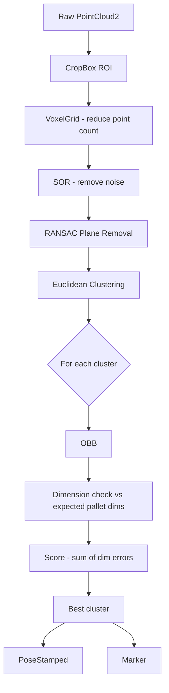

# Pallet Detector

## Overview

ROS packages for pallet detector. Includes:

- **pallet_camera_gz**: Gazebo simulation with an RGBD camera on a stand and a pallet model
- **pallet_detector**: ROS package to detect pallets from point cloud data

## Prerequisites

- ROS Noetic 
- Gazebo 

## How to Run

To launch the Gazebo simulation with the camera stand and pallet:

```bash
roslaunch pallet_camera_gz pallet_camera.launch
```
This command:
1. Starts Gazebo with the `pallet_camera.world`
2. Spawns the camera stand with an RGBD depth sensor
3. Publishes TF frames (`world` → `stand_link` → `rgbd_camera_link`)

To launch the pallet detector:

```bash
roslaunch pallet_detector pallet_detector.launch
```

1. To see in RViz the filtered point cloud with no floor (plane removed), add a **PointCloud2** display → topic: `/cloud_no_plane`
2. To visualize the detected pallet bounding box and pose, add a **Marker** display → topic: `/pallet_marker`
3. To visualize only the ROI-cropped cloud (before plane removal), add a **PointCloud2** display → topic: `/cloud_roi`

To convert from RGBD camera optical frame to world frame:

```bash
rosrun pallet_camera_gz publish_camera_tf.py
```

### Available Topics

#### Camera (Gazebo)

| Topic | Description |
|---|---|
| `/demo/rgb/image_raw` | RGB camera image |
| `/demo/rgb/camera_info` | RGB camera intrinsics |
| `/demo/depth/image_raw` | Depth image |
| `/demo/depth/camera_info` | Depth camera intrinsics |
| `/demo/depth/points` | 3D point cloud (input to detector) |

#### Pallet Detector

| Topic | Type | Description |
|---|---|---|
| `/cloud_roi` | `sensor_msgs/PointCloud2` | Point cloud after CropBox ROI filtering |
| `/cloud_no_plane` | `sensor_msgs/PointCloud2` | Point cloud after dominant plane (floor) removal |
| `/pallet_pose` | `geometry_msgs/PoseStamped` | 6-DOF pose of the detected pallet (OBB center + orientation) |
| `/pallet_marker` | `visualization_msgs/Marker` | Green bounding box marker for RViz visualization |

### Visualize in RViz

Set **Fixed Frame** to `world`, then add:
- **Image** → topic: `/demo/rgb/image_raw`
- **PointCloud2** → topic: `/demo/depth/points` (raw input cloud)
- **PointCloud2** → topic: `/cloud_roi` (ROI-cropped cloud)
- **PointCloud2** → topic: `/cloud_no_plane` (floor removed, objects only)
- **Marker** → topic: `/pallet_marker` (green box around detected pallet)

---

## Detection Pipeline



### CropBox ROI

A 3D axis-aligned box is defined by configurable min/max bounds in x, y, and z (in the camera's optical frame). `pcl::CropBox` discards every point that falls outside this box before any other processing happens. This is important because it removes the floor, ceiling, walls, and anything else far outside the region where we expect a pallet to be — keeping the downstream steps fast and reducing false detections.

### Statistical Outlier Removal (SOR)

For each point, PCL computes the mean distance to its K nearest neighbours. Points whose mean distance is more than N standard deviations above the global mean are classified as outliers and removed. This handles isolated noisy points that the depth sensor produces (e.g. on reflective or transparent surfaces). SOR is disabled by default (`use_sor: false`) since it adds processing time and is not always necessary.

### Euclidean Clustering

After the dominant plane is removed, the remaining points belong to objects resting on that surface. Euclidean clustering groups them by proximity: starting from a seed point, all points within `cluster_tolerance` (default 5 cm) are added to the same cluster using a KD-tree for fast neighbour lookups. This flood-fill process repeats until no more nearby points are found, then a new seed starts the next cluster. Groups smaller than `cluster_min_size` (noise) or larger than `cluster_max_size` (merged objects or errors) are discarded. Each surviving cluster is then evaluated for pallet-like dimensions.

### OBB Dimension Matching

For each surviving cluster, an Oriented Bounding Box (OBB) is computed using PCL's moment of inertia estimation. The three OBB dimensions are sorted smallest-to-largest and compared against the expected pallet dimensions (height, width, length). A cluster passes if all three dimensions fall within their respective tolerances. The cluster with the lowest score (sum of absolute dimension errors) is selected as the detected pallet.

---

## Configuration

All parameters are loaded from [config/roi.yaml](src/pallet_detector/config/roi.yaml) via the launch file. Key parameters:

| Parameter | Default | Description |
|---|---|---|
| `x_min` / `x_max` | -1.5 / 1.5 | ROI bounds in x (left/right in camera optical frame) |
| `y_min` / `y_max` | 0.2 / 1.0 | ROI bounds in y (up/down) |
| `z_min` / `z_max` | 1.0 / 3.5 | ROI bounds in z (depth/forward) |
| `voxel_leaf` | 0.02 | Voxel grid leaf size in meters (smaller = more points, slower) |
| `use_sor` | false | Enable Statistical Outlier Removal |
| `plane_dist_thresh` | 0.02 | RANSAC plane inlier distance threshold |
| `cluster_tolerance` | 0.05 | Max distance (m) between points in the same cluster |
| `cluster_min_size` | 500 | Minimum points for a valid cluster |
| `pallet_length` | 1.2 | Expected pallet length (m) |
| `pallet_width` | 0.8 | Expected pallet width (m) |
| `pallet_height` | 0.15 | Expected pallet height (m) |
| `tol_length` / `tol_width` / `tol_height` | 0.10 / 0.10 / 0.06 | Dimension match tolerances (m) |

