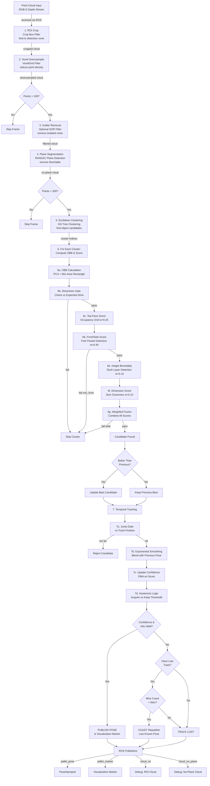

# Pallet Detector

## Overview

ROS packages for pallet detector. Includes:

- **pallet_camera_gz**: Gazebo simulation with an RGBD camera on a stand and a pallet model
- **pallet_detector**: ROS package to detect pallets from point cloud data

## Prerequisites

- ROS Noetic 
- Gazebo 

## How to Run

To launch the Gazebo simulation with the camera stand and pallet:

```bash
roslaunch pallet_camera_gz pallet_camera.launch
```
This command:
1. Starts Gazebo with the `pallet_camera.world`
2. Spawns the camera stand with an RGBD depth sensor
3. Publishes TF frames (`world` → `stand_link` → `rgbd_camera_link`)

To launch the pallet detector:

```bash
roslaunch pallet_detector pallet_detector.launch
```

1. To see in RViz the filtered point cloud with no floor (plane removed), add a **PointCloud2** display → topic: `/cloud_no_plane`
2. To visualize the detected pallet bounding box and pose, add a **Marker** display → topic: `/pallet_marker`
3. To visualize only the ROI-cropped cloud (before plane removal), add a **PointCloud2** display → topic: `/cloud_roi`

To convert from RGBD camera optical frame to world frame:

```bash
rosrun pallet_camera_gz publish_camera_tf.py
```

### Available Topics

#### Camera (Gazebo)

| Topic | Description |
|---|---|
| `/demo/rgb/image_raw` | RGB camera image |
| `/demo/rgb/camera_info` | RGB camera intrinsics |
| `/demo/depth/image_raw` | Depth image |
| `/demo/depth/camera_info` | Depth camera intrinsics |
| `/demo/depth/points` | 3D point cloud (input to detector) |

#### Pallet Detector

| Topic | Type | Description |
|---|---|---|
| `/cloud_roi` | `sensor_msgs/PointCloud2` | Point cloud after CropBox ROI filtering |
| `/cloud_no_plane` | `sensor_msgs/PointCloud2` | Point cloud after dominant plane (floor) removal |
| `/pallet_pose` | `geometry_msgs/PoseStamped` | 6-DOF pose of the detected pallet (OBB center + orientation) |
| `/pallet_marker` | `visualization_msgs/Marker` | Green bounding box marker for RViz visualization |

### Visualize in RViz

Set **Fixed Frame** to `world`, then add:
- **Image** → topic: `/demo/rgb/image_raw`
- **PointCloud2** → topic: `/demo/depth/points` (raw input cloud)
- **PointCloud2** → topic: `/cloud_roi` (ROI-cropped cloud)
- **PointCloud2** → topic: `/cloud_no_plane` (floor removed, objects only)
- **Marker** → topic: `/pallet_marker` (green box around detected pallet)

---

## Detection Pipeline



### CropBox ROI

A 3D axis-aligned box is defined by configurable min/max bounds in x, y, and z (in the camera's optical frame). `pcl::CropBox` discards every point that falls outside this box before any other processing happens. This is important because it removes the floor, ceiling, walls, and anything else far outside the region where we expect a pallet to be — keeping the downstream steps fast and reducing false detections.

### Statistical Outlier Removal (SOR)

For each point, PCL computes the mean distance to its K nearest neighbours. Points whose mean distance is more than N standard deviations above the global mean are classified as outliers and removed. This handles isolated noisy points that the depth sensor produces (e.g. on reflective or transparent surfaces). SOR is disabled by default (`use_sor: false`) since it adds processing time and is not always necessary.

### Euclidean Clustering

After the dominant plane is removed, the remaining points belong to objects resting on that surface. Euclidean clustering groups them by proximity: starting from a seed point, all points within `cluster_tolerance` (default 5 cm) are added to the same cluster using a KD-tree for fast neighbour lookups. This flood-fill process repeats until no more nearby points are found, then a new seed starts the next cluster. Groups smaller than `cluster_min_size` (noise) or larger than `cluster_max_size` (merged objects or errors) are discarded. Each surviving cluster is then evaluated for pallet-like dimensions.

### OBB Computation (Oriented Bounding Box)

For each surviving cluster, an Oriented Bounding Box (OBB) is computed using **PCA + Minimum-Area Bounding Rectangle**:

1. **PCA** finds the thin axis (height direction) from the smallest eigenvalue
2. **2D Convex Hull** (Andrew's monotone chain) projects points onto the top face
3. **Rotating Calipers** finds the minimum-area bounding rectangle in the horizontal plane
4. Result: OBB center position, rotation matrix, and half-extents

This hybrid approach is **immune to point-density bias** from camera viewpoint variation—critical for detecting pallets at different angles.

### Multi-Cue Scoring System

Rather than relying on a single metric, the detector fuses four independent cues into a combined confidence score:

#### Top-Face Occupancy Score (weight = 0.25)

**Insight:** Wooden pallets have deck boards separated by gaps → 30-80% fill, NOT 0% or 100%.

- Project cluster points onto OBB top face
- Discretize into 2 cm cells
- Compute fill ratio (occupied cells / total cells)
- Score peaks near nominal fill range; penalizes fully solid or empty objects

#### Front/Side Structural Score (weight = 0.45, dominant)

**Insight:** Pallet forks penetrate from bottom → void columns in lower half; deck boards visible in upper half.

- Evaluate both long×height and mid×height vertical faces
- Discretize into 2 cm cells; decompose into lower-band (0-55%) and upper-band (55-100%)
- Sub-scores:
  - **Fill score** (35%): Overall occupancy in nominal range
  - **Void columns** (40%): Count columns with low occupancy in lower band; reward ≥2 voids
  - **Upper occupancy** (15%): Require ≥25% fill in top band (deck/stringer presence)
  - **Contrast** (10%): Reward upper fill > lower fill (structural layering)
- **Hard gate:** front_score ≥ 0.35 required—strong discrimination against solid boxes

#### Height Bimodality Score (weight = 0.15)

**Insight:** Pallets show two distinct height peaks (deck + support); solid cubes show single broad peak.

- Discretize cluster occupancy along OBB height axis into 12 histogram bins
- Find two peaks (lower and upper halves)
- Compute valley-to-peak ratio: **lower ratio → higher score**
- Bonus for balanced peaks (symmetric distribution)

#### Dimension Closeness Score (weight = 0.15)

**Insight:** Penalize clusters whose dimensions deviate from expected pallet size.

- Compute normalized error: `(|H_det - H_exp| + |W_det - W_exp| + |L_det - L_exp|) / 3 / tolerance`
- Convert to score in [0, 1]; soft penalty (does not hard-gate)

#### Weighted Fusion

Combine into single cluster confidence:
```
total_score = 0.15 × s_dim + 0.25 × s_top + 0.45 × s_front + 0.15 × s_height
```

**Design decision:** Front structure weighted heavy (45%) because it's most pallet-specific; dimension weighted light (15%) for tolerance to real-world variation.

Per-frame best: **publish the highest-scoring cluster** (if `total_score ≥ 0.62`)

### Temporal Tracking & Hysteresis

Raw per-frame detections are noisy. The tracker adds stability via smoothing + asymmetric confidence thresholds:

#### Jump Gating
- If tracking an object, reject candidates >0.3 m from last pose (prevents lock-on to different pallets)

#### Pose Smoothing
- Blend new pose with previous: `pose_new = 0.3 × pose_new + 0.7 × pose_old`
- Reduces jitter; stays responsive

#### Confidence Hysteresis
- Maintain EMA: `conf(t) = 0.8 × conf(t-1) + 0.2 × score_frame`
- **Acquisition threshold:** conf ≥ 0.70 AND ≥2 consecutive hits → start new track
- **Keepalive threshold:** conf ≥ 0.45 → maintain existing track
- Asymmetry prevents oscillation; lower keepalive allows temporary occlusions

#### Coasting
- If track lost: coast for up to 5 frames, republishing last known pose
- After 5 frames: declare track fully lost; wait for new acquisition

---

## Configuration

All parameters are loaded from [config/roi.yaml](src/pallet_detector/config/roi.yaml) via the launch file. Key parameters:

| Parameter | Default | Description |
|---|---|---|
| `x_min` / `x_max` | -1.2 / 1.2 | ROI bounds in x (left/right in camera optical frame) |
| `y_min` / `y_max` | 0.2 / 1.0 | ROI bounds in y (up/down) |
| `z_min` / `z_max` | 1.0 / 3.5 | ROI bounds in z (depth/forward) |
| `voxel_leaf` | 0.02 | Voxel grid leaf size in meters |
| `use_sor` | false | Enable Statistical Outlier Removal |
| `plane_dist_thresh` | 0.02 | RANSAC plane inlier distance threshold (m) |
| `cluster_tolerance` | 0.05 | Max distance between points in same cluster (m) |
| `cluster_min_size` | 500 | Minimum points for valid cluster |
| `pallet_length` | 1.2 | Expected pallet length (m) |
| `pallet_width` | 0.8 | Expected pallet width (m) |
| `pallet_height` | 0.15 | Expected pallet height (m) |
| `tol_length` / `tol_width` / `tol_height` | 0.10 / 0.10 / 0.06 | Dimension tolerances (m) |
| `occupancy_cell_size` | 0.02 | Grid cell size for top-face scoring (m) |
| `min_fill_ratio` / `max_fill_ratio` | 0.3 / 0.8 | Nominal pallet top-face fill range |
| `front_cell_size` | 0.02 | Grid cell size for front/side face scoring (m) |
| `front_fill_min` / `front_fill_max` | 0.12 / 0.85 | Nominal front face occupancy range |
| `front_min_void_columns` | 2 | Minimum void columns for pocket-like structure |
| `w_dim` / `w_top` / `w_front` / `w_height` | 0.15 / 0.25 / 0.45 / 0.15 | Scoring weights |
| `min_total_score` | 0.62 | Threshold for candidate acceptance |
| `track_gate_dist` | 0.3 | Max allowed position jump (m) for same track |
| `track_acquire_conf` / `track_keep_conf` | 0.70 / 0.45 | Confidence thresholds for acquisition/keepalive |
| `track_alpha` / `track_conf_alpha` | 0.3 / 0.2 | Smoothing factors for pose and confidence EMA |
| `track_max_miss` | 5 | Max frames to coast on last pose before losing track |


