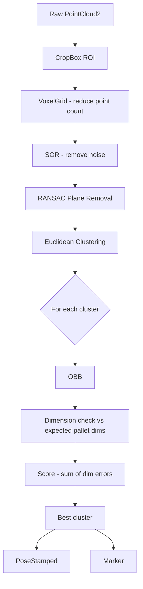

# Pallet Detector

## Overview

ROS packages for pallet detector. Includes:

- **pallet_camera_gz**: Gazebo simulation with an RGBD camera on a stand and a pallet model
- **pallet_detector**: ROS package to detect pallets from point cloud data

## Prerequisites

- ROS Noetic 
- Gazebo 

## How to Run

To launch the Gazebo simulation with the camera stand and pallet:

```bash
roslaunch pallet_camera_gz pallet_camera.launch
```

1. Start Gazebo with the `pallet_camera.world`
2. Spawn the camera stand with an RGBD depth sensor
3. Publish TF frames (`world` → `stand_link` → `rgbd_camera_link`)

### Available Topics

| Topic | Description |
|---|---|
| `/demo/rgb/image_raw` | RGB camera image |
| `/demo/rgb/camera_info` | RGB camera intrinsics |
| `/demo/depth/image_raw` | Depth image |
| `/demo/depth/camera_info` | Depth camera intrinsics |
| `/demo/depth/points` | 3D point cloud |

### Visualize 

In Rviz add displays for:
- **Image** → topic: `/demo/rgb/image_raw`
- **PointCloud2** → topic: `/demo/depth/points` (set Fixed Frame to `world`)

---

## Detection Pipeline



### CropBox ROI

A 3D axis-aligned box is defined by configurable min/max bounds in x, y, and z (in the camera's optical frame). `pcl::CropBox` discards every point that falls outside this box before any other processing happens. This is important because it removes the floor, ceiling, walls, and anything else far outside the region where we expect a pallet to be — keeping the downstream steps fast and reducing false detections.

### Statistical Outlier Removal (SOR)

For each point, PCL computes the mean distance to its K nearest neighbours. Points whose mean distance is more than N standard deviations above the global mean are classified as outliers and removed. This handles isolated noisy points that the depth sensor produces (e.g. on reflective or transparent surfaces). SOR is disabled by default (`use_sor: false`) since it adds processing time and is not always necessary.

### Euclidean Clustering

After the dominant plane is removed, the remaining points belong to objects resting on that surface. Euclidean clustering groups them by proximity: starting from a seed point, all points within `cluster_tolerance` (default 5 cm) are added to the same cluster using a KD-tree for fast neighbour lookups. This flood-fill process repeats until no more nearby points are found, then a new seed starts the next cluster. Groups smaller than `cluster_min_size` (noise) or larger than `cluster_max_size` (merged objects or errors) are discarded. Each surviving cluster is then evaluated for pallet-like dimensions.

